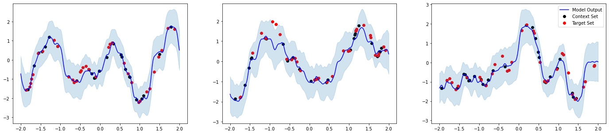
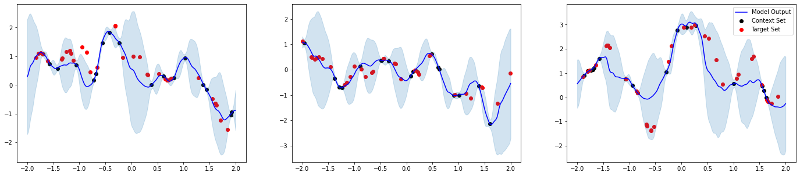

# Daily Notes

14 October 2021

- Did not receive a response yet from Wessel, so instead worked on attempting to run the code myself.
- Have set up Python environment locally, however, have encountered an error at runtime:
  - ```train.py``` attempts to compute ```loss = compute_loss(model, batch)``` but runs into problem in [plum](https://github.com/wesselb/plum) ```plum.function.NotFoundLookupError: For function "device", signature Signature(torch.device) could not be resolved.```
- In the meantime, attempted to run the [original ConvCNP](https://github.com/cambridge-mlg/convcnp) locally which worked, but then would have overwhelmed my computer's resources. Instead, I ran the suggested [Jupyter notebook](https://github.com/cambridge-mlg/convcnp/blob/master/convcnp_regression.ipynb) on Google Colab to reproduce the 1D Gaussian process experiments from their [ICLR paper](https://openreview.net/forum?id=Skey4eBYPS), which worked perfectly but took 1 h 16 mins to reach epoch 50.
  - 
  - 
- Also set up a workspace on [Azure Machine Learning (AML)](https://ml.azure.com) using their free credits for students.

## Next steps

  - [ ] Go through [tutorial](https://docs.microsoft.com/en-us/azure/machine-learning/tutorial-1st-experiment-hello-world) on training a model in AML.
  - [ ] Train a basic ConvCNP in AML.
  - [ ] Check if multi-output ConvCNP works in AML as opposed to my computer.
